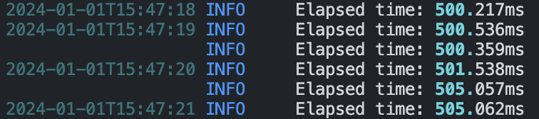
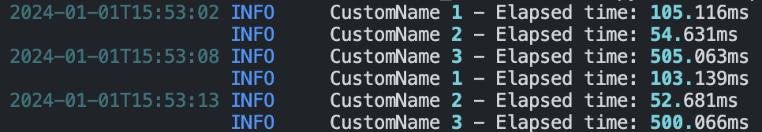

# TimeGuardian

TimeGuardian is a Python package designed for measuring and logging the execution time of functions. This package is especially useful for performance monitoring and optimization in Python applications.

## Features

- Easy-to-use decorators for timing functions.
- Integrated logging with rich formatting.

## Installation

You can install TimeGuardian directly from pip:

```bash
pip install timeguardian
```

Alternatively, if you have downloaded the source code, you can install it using:

```bash
cd path/to/TimeGuardian
pip install timeguardian
```

## Usage

Import `time_func` from the `timeguardian` package and use it as a decorator on your functions to measure their execution time.

### Basic Usage

```python
from timeguardian import time_func

@time_func
def my_function():
    # Your function implementation
```

<br>
Terminal output:<br>


### Advanced Usage

You can also provide a custom name for logging the execution time:

```python
from timeguardian import time_func

@time_func(name="CustomFunctionName")
def another_function():
    # Another function implementation
```
<br>
Terminal output:<br>


## Contributing

Contributions to TimeGuardian are welcome!

## License

This project is licensed under the MIT License - see the [LICENSE](LICENSE) file for details.
